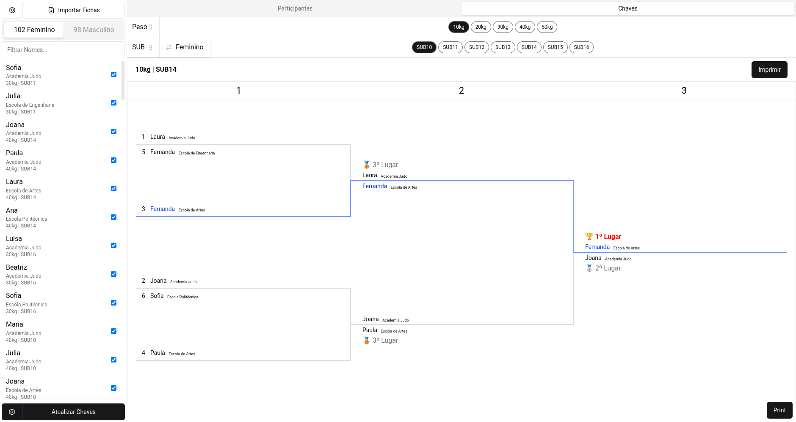
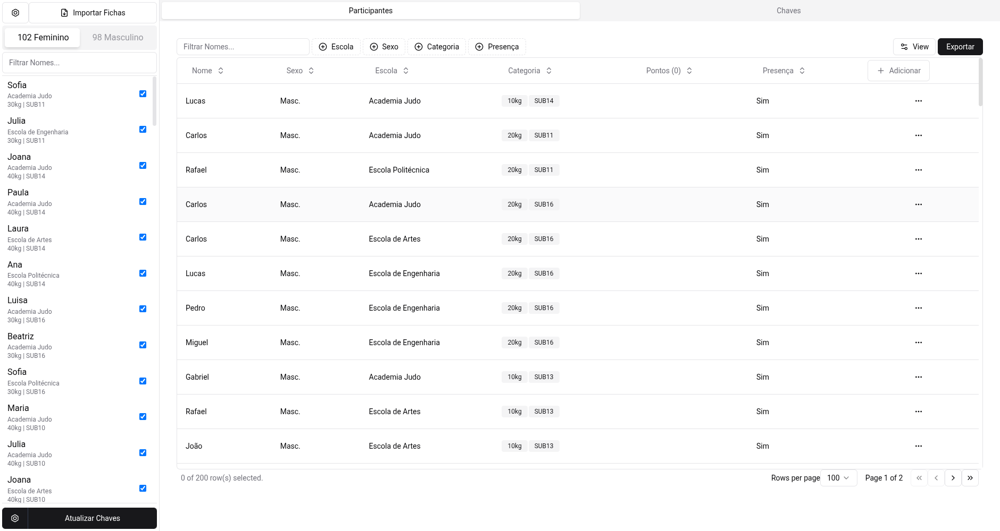

# Gerenciador de Chaves de Judô

<p align="center">


</p>

Este é um aplicativo Electron construído com Svelte e TypeScript, projetado para gerenciar participantes e gerar chaves de torneio para eventos de judô. Ele permite a importação de fichas, o registro de participantes com detalhes como nome, sexo, escola, categoria (peso e SUB), e a visualização e impressão de chaves de luta com resultados (1º, 2º e 3º lugar).

## Funcionalidades

- **Importação de Fichas:** Carregue dados de participantes para agilizar o processo de inscrição.
- **Gerenciamento de Participantes:**
    - Visualização de uma lista de todos os participantes com detalhes.
    - Filtragem por nome, escola, sexo, categoria e presença.
    - Adição e remoção de participantes (implícito pela interface).
- **Geração de Chaves:**
    - Geração automática de chaves de torneio baseadas nas categorias de peso e SUB.
    - Visualização interativa das chaves de luta.
    - Registro de resultados (1º, 2º e 3º lugar) nas chaves.
- **Impressão:**
    - Capacidade de imprimir as chaves geradas.
    - Exportação de dados (implícito pelo botão "Exportar" na tela de participantes).
  - **Interface Amigável:** Interface de usuário limpa e intuitiva para fácil navegação e gerenciamento.

## Telas

As imagens fornecidas ilustram as seguintes funcionalidades:

  - **Tela de Participantes:** Exibe uma tabela com todos os participantes, permitindo filtrar e adicionar novos registros. Colunas incluem Nome, Sexo, Escola, Categoria (Peso e SUB), Pontos e Presença.
  - **Tela de Chaves:** Mostra uma chave de torneio gerada para uma categoria específica (por exemplo, 10kg / SUB14), com a progressão das lutas e a indicação dos vencedores de 1º, 2º e 3º lugar.

## Tecnologias Utilizadas

Este projeto é um aplicativo Electron utilizando as seguintes tecnologias:

- **Svelte**: Um framework reativo para construção de interfaces de usuário.
- **TypeScript**: Um superset tipado de JavaScript para código mais robusto e escalável.
- **Electron**: Para construir aplicações desktop multiplataforma usando tecnologias web.
- **Tailwind CSS**: Um framework CSS utilitário para estilização rápida e responsiva.
- **Vite**: Um bundler de próxima geração para desenvolvimento front-end rápido.
- **@tanstack/table-core**: Para gerenciamento eficiente de tabelas na interface de participantes.
- **exceljs**: Para manipulação de arquivos Excel, possivelmente para importação/exportação de dados.
- **bits-ui**: Uma biblioteca de componentes Svelte.
- **formsnap**: Para manipulação de formulários.
- **vaul-svelte**: Para componentes de interface como drawers.
- **@lucide/svelte, lucide-svelte**: Ícones para a interface do usuário.
- **@thisux/sveltednd**: Para funcionalidade de arrastar e soltar, possivelmente usada na organização das chaves.
- **bracketry**: Uma biblioteca para trabalhar com estruturas de bracket, fundamental para a geração de chaves.

## Estrutura do Projeto

O projeto `package.json` revela uma estrutura típica de um aplicativo Electron com Svelte e TypeScript, incluindo scripts para desenvolvimento, compilação e empacotamento para diferentes sistemas operacionais.

- `src/main`: Contém o código principal do processo Electron.
- `src/renderer`: Contém o código Svelte para a interface do usuário.
- `src/preload`: Scripts de pré-carregamento para a comunicação segura entre o processo principal e o renderizador.

## Instalação e Execução

Para configurar e executar o projeto localmente, siga os passos abaixo:

1.  **Clone o repositório:**
    ```bash
    git clone [URL_DO_REPOSITORIO]
    cd judo-chaves-svelte
    ```
2.  **Instale as dependências:**
    Este projeto usa `yarn` como gerenciador de pacotes.
    ```bash
    yarn install
    ```
3.  **Executar em modo de desenvolvimento:**
    ```bash
    yarn dev
    ```
4.  **Compilar para produção:**
    ```bash
    yarn build
    ```

### Comandos de Build

- `yarn build:unpack`: Compila o aplicativo e o empacota sem instalador.
- `yarn build:win`: Compila e empacota para Windows.
- `yarn build:mac`: Compila e empacota para macOS.
- `yarn build:linux`: Compila e empacota para Linux.

